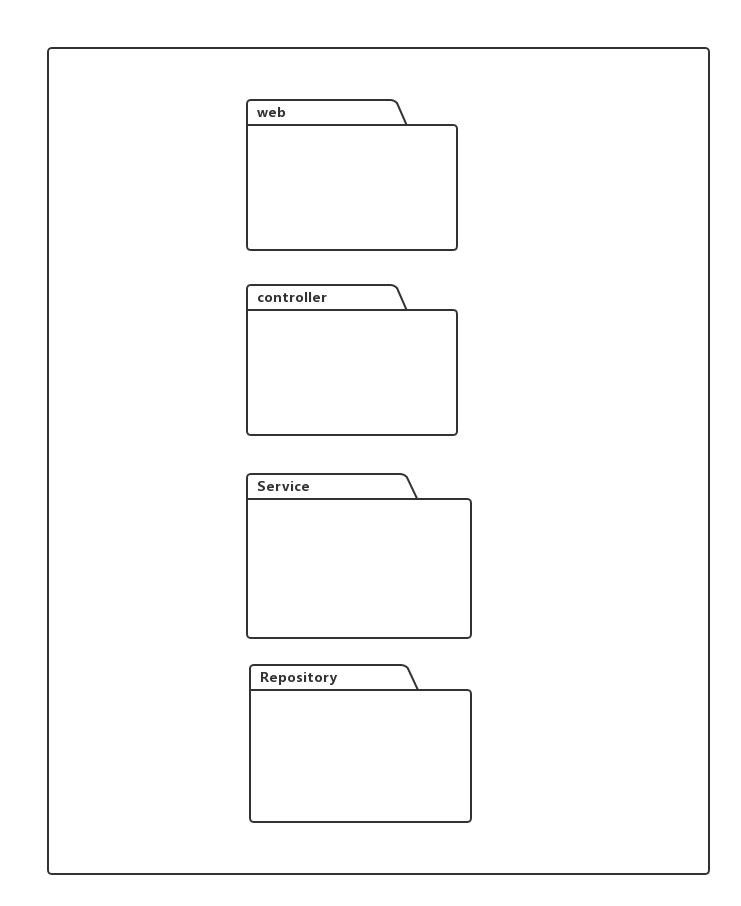
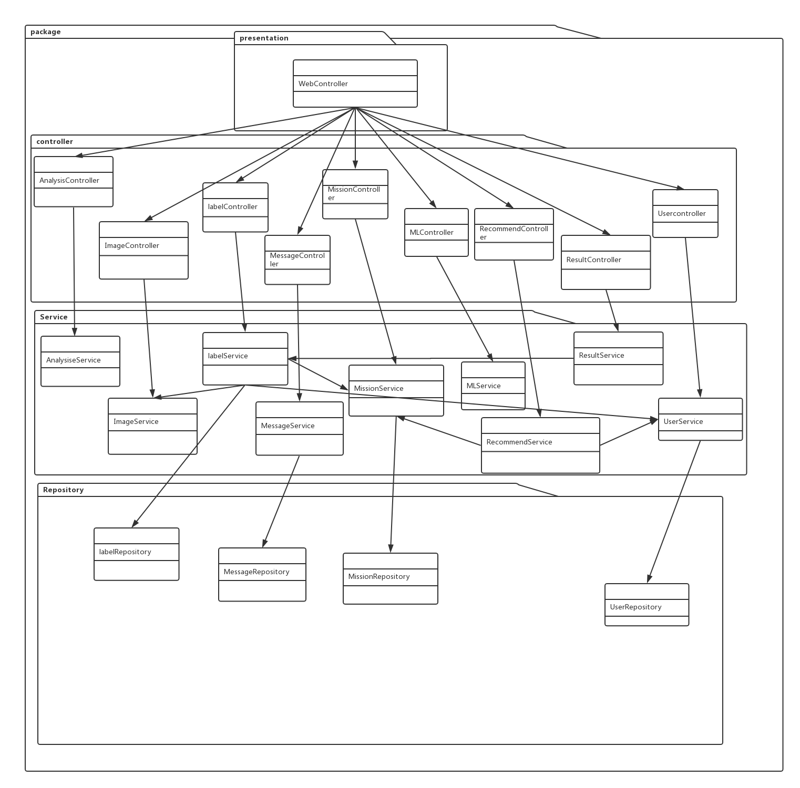
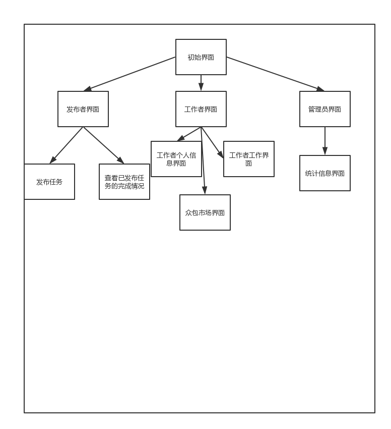

# 项目设计文档（迭代三）

众包标注系统

COUNTS 

项目设计文档

(迭代三)

南京大学软件学院

FX团队

伏家兴 韩新虎  刘雅歆 徐光耀

2018年5月30日

[TOC]

## 更新历史

| 修改成员 | 修改日期   | 修改原因     | 版本号 |
| -------- | ---------- | ------------ | ------ |
| 全体成员 | 2018.05.20 | 项目启动     | v1.0   |
| 韩新虎   | 2018.05.30 | 修改部分内容 | v1.1   |
|          |            |              |        |
|          |            |              |        |
|          |            |              |        |

## 1. 引言

### 1.1. 编制目的

本文档描述众包标注系统(COUNTS)的概要设计，达到指导详细设计和开放的目的，同时实现和测试人员及用户的沟通

本文档面向开发人员、测试人员及最终用户而编写，是了解系统的导航。

### 1.2参考资料

1. 《众包标注系统（迭代二）需求规格说明文档》
2. 《软件工程与计算（卷二）》
3. 《软件工程与计算（卷三）》
4. IEEE标准

## 2. 产品概述

本项目旨在建立一个众包标注系统。该项目能够接受众包发起者(Requestor)的标注请求，并将请求分发给众包工人(Worker),工人在平台进行简易数据标注，系统评估并将标注结果反馈给众包发起者。同时系统和众包发起者可以评估工人的完成量并给予奖励；系统具有一个或者多个智能化模块

## 3. 逻辑视角

众包标注系统（COUNTS)选择了分层体系结构风格，将系统分为四层（界面层、控制层，服务处，数据层）能够很好地示意整个高层抽象。界面层包含GUI的实现，控制层包含界面控制的处理，服务层包含逻辑的处理，数据层负责数据的持久化和访问。

## 4. 组合视角

包图如下

## 5. 接口视角

### 5.1 模块的职责

| 模块   | 职责                                   |
| ------ | -------------------------------------- |
| 界面层 | 基于web的众包标注平台界面              |
| 控制层 | 对于用户界面输入响应和界面控制处理逻辑 |
| 服务层 | 处理详细的逻辑                         |
| 数据层 | 负责数据的持久化及数据访问接口         |

### 5.2 用户界面层的分解

​	根据需求，系统存在以下几个用户界面，启动界面，requestor界面，worker主界面，woker工作界面等4个界面，用户界面利用vue框架＋html css js实现，跳转风格为委托式风格，跳转界面如下图所示。

​	控制层包括多个针对界面的逻辑处理对象。控制层模块的职责如下表所示。

| 模块                | 职责                         |
| ------------------- | ---------------------------- |
| UserController      | 实现登录登出注册所需要的服务 |
| LableController     | 实现标记所需要的服务         |
| MissionController   | 实现任务所需要的服务         |
| MessageController   | 实现消息通知所需要的服务     |
| ImageController     | 实现图片上传，下载的服务     |
| AnalysisController  | 实现分析所需要的服务。       |
| MLController        | 实现机器学习所需要的服务     |
| ResultController    | 实现标注结果所需要的服务     |
| RecommentController | 实现推荐所需要的服务         |
|                     |                              |

### 5.3 服务层的分解

| 模块            | 职责                                 |
| --------------- | ------------------------------------ |
| AnalysisService | 实现数据分析的逻辑                   |
| ImageService    | 实现上传、下载图片的逻辑             |
| LabelService    | 实现标注相关操作的逻辑               |
| MessageService  | 实现消息通知的相关逻辑               |
| MissionService  | 实现任务（接任务，发布任务）相关逻辑 |
| MLService       | 实现机器学习的相关逻辑               |
| ResultService   | 实现标注结果的相关逻辑               |
| UserService     | 实现用户操作的相关逻辑               |
|                 |                                      |

### 5.4 数据层的分解

​	数据层主要是给控制层提供数据访问服务，包括对于结构化数据的查询，以及将非结构化数据转换为结构化数据。数据层模块的职责如下表所示。

| 模块              | 职责                                                         |
| ----------------- | ------------------------------------------------------------ |
| UserRepository    | 提供用户信息数据的访问服务，以及将非结构化数据转换为结构化数据。 |
| LabelRepository   | 提供标注信息数据的访问服务，以及将非结构化数据转换为结构化数据。 |
| MissionRepository | 提供任务信息数据的访问服务，以及将非结构化数据转换为结构化数据。 |
| MessageRepository | 提供信息数据的访问服务，以及将非数据化转换为结构化数据       |
|                   |                                                              |

## 6. 信息视角

### 6.1. 数据对象

详情参加项目中 Server/src/main/java/com/fx/model

| 类名                | 包含的属性                                                   |
| ------------------- | ------------------------------------------------------------ |
| User                | id,用户名,密码,手机号码,邮箱,身份,用户简介,头像，任务列表，积分，评分，级别，正确性，省份，城市。 |
| Mission             | id,requestorID,missionName,description, begin,end,type,selects,maxNumber ,currentNumber,points |
| AttributeLabel      | fileName,attributes                                          |
| CaptionLabel        | fileName,capture                                             |
| ClassificationLabel | fileName,select                                              |
| DetectionLabel      | fileName,rectangles                                          |
| SegmentLabel        | fileName,dots                                                |
|                     |                                                              |